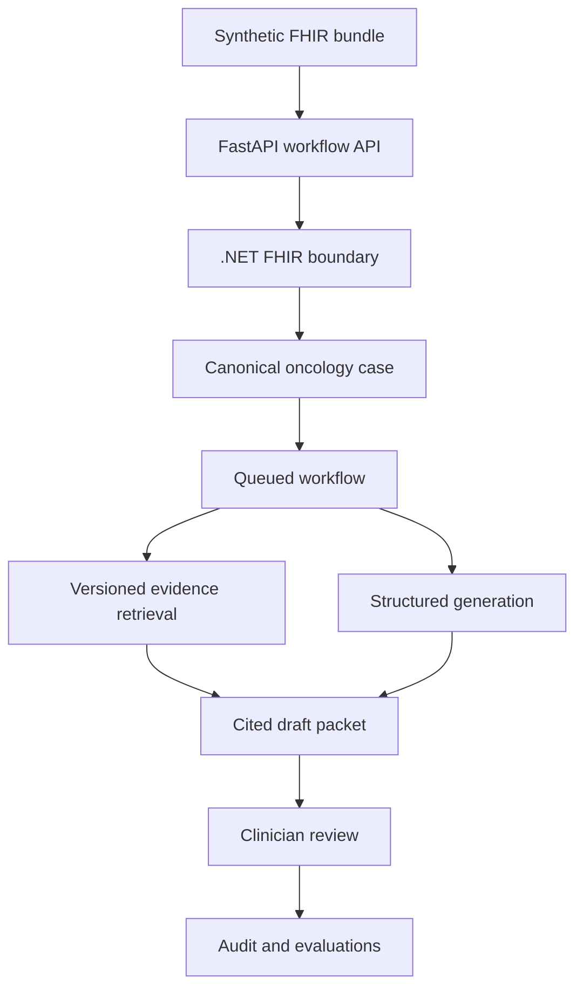

# Oncology Workflow Copilot

[](https://github.com/muminfarooq190/oncology-workflow-copilot/actions/workflows/ci.yml)

An evaluation-first, clinician-reviewed workflow for converting **synthetic FHIR R4 oncology records** into an auditable tumor-board preparation packet.

This is a healthcare forward-deployed-engineering portfolio project, not a generic medical chatbot. The initial clinical scope is non-small-cell lung cancer (NSCLC). It demonstrates interoperability, regulated-system design, evidence retrieval, human review, evaluations, observability, and production handoff.

> **Safety boundary:** This repository uses synthetic data only. It does not diagnose, prescribe, replace clinical judgment, or claim HIPAA compliance. Generated packets are drafts that require an authorized clinician's review and approval.

## Target workflow

1. Accept a synthetic FHIR R4 `Bundle`.
2. Validate and normalize it into a versioned canonical oncology case.
3. identify missing or contradictory clinical information.
4. Retrieve evidence from a frozen, versioned corpus.
5. Generate a schema-constrained tumor-board preparation packet.
6. Verify claim-level citations and escalate unsafe or uncertain cases.
7. Capture clinician corrections, approval, provenance, latency, and cost.



## Repository map

| Path | Purpose |
|---|---|
| `apps/web` | React/TypeScript clinician review interface |
| `services/orchestrator` | FastAPI workflow orchestration and evaluation hooks |
| `services/fhir-integration` | .NET 8 FHIR validation and canonicalization boundary |
| `contracts` | Versioned JSON contracts shared across services |
| `data/synthetic-fhir` | Synthetic FHIR R4 inputs only |
| `evidence` | Versioned evidence manifests; licensed source text is not committed by default |
| `evals` | Cases, gold labels, scorers, and generated reports |
| `infra` | Local Docker, Terraform, and Kubernetes assets as the project matures |
| `docs` | Product, architecture, safety, evaluation, and operating decisions |

## Quick start

Prerequisites: Node.js 22+, Python 3.12+, .NET 8 SDK, Docker with Compose.

```bash
cp .env.example .env
make install
make test
docker compose up --build
```

Local endpoints after the complete stack starts:

- Web UI: `http://localhost:5173`
- Orchestrator API: `http://localhost:8000/docs`
- FHIR integration service: `http://localhost:8081/health`
- Keycloak: `http://localhost:8082`

## Delivery plan

The implementation is deliberately staged. See [the execution roadmap](docs/ROADMAP.md), [launch criteria](docs/LAUNCH_CRITERIA.md), and [evaluation plan](docs/EVALUATION_PLAN.md). A feature is not considered complete because the output “looks good”; it must pass deterministic tests and the relevant clinical evaluation threshold.

## Current status

**Week 7 — durable orchestration:** PostgreSQL-backed state and idempotent intake, a transactional outbox, Redis Streams workers with recovery and bounded retries, dead-letter requeue, database-enforced append-only audit, dependency readiness, and real-service integration tests. The Week 6 .NET FHIR normalizer remains the sole interpreter of raw FHIR.

## Contribution rules

Read [CONTRIBUTING.md](CONTRIBUTING.md) before opening a pull request. Never add real patient data, credentials, paid guideline text, or screenshots containing protected information.
