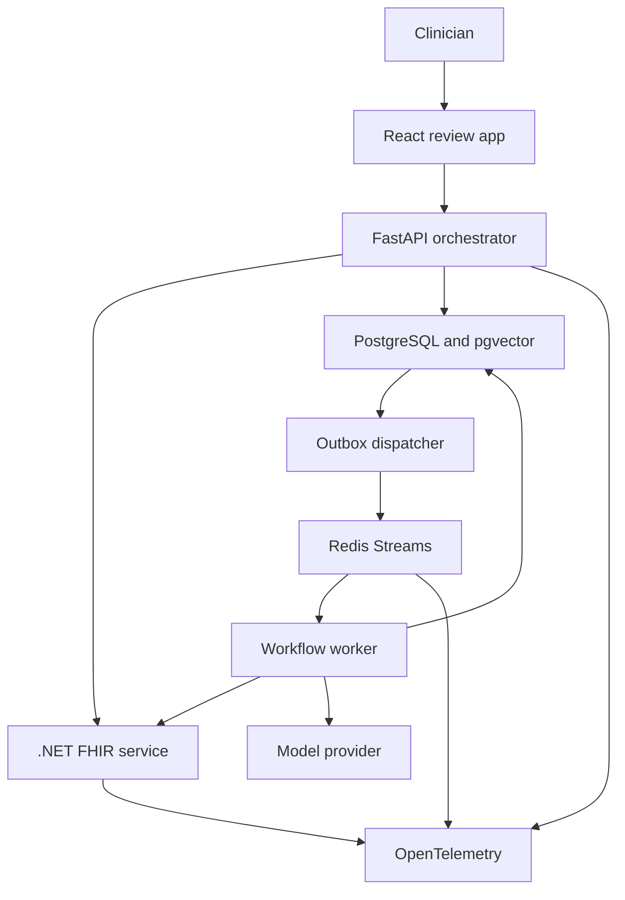
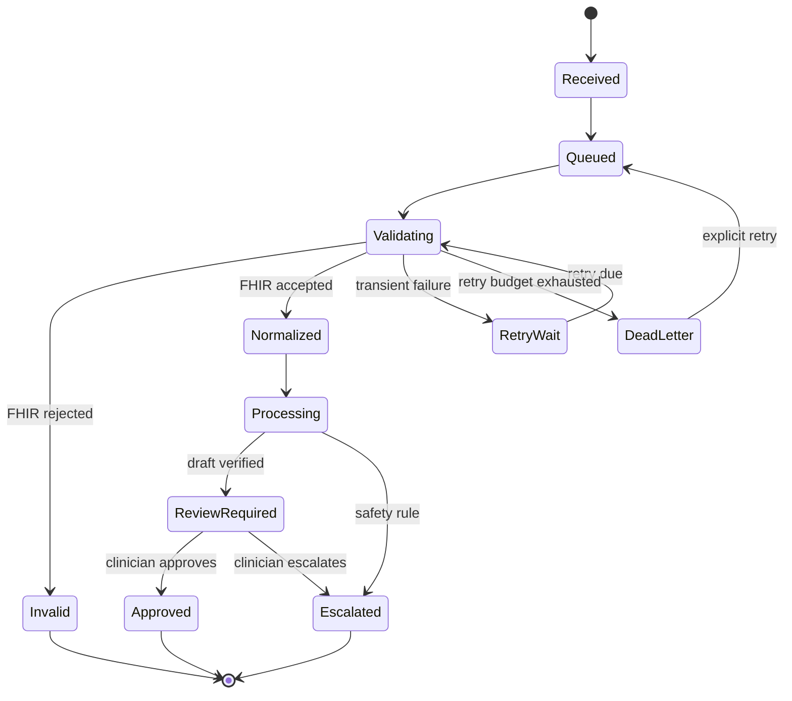

# Architecture

## Design principles

1. **Deterministic workflow before autonomy.** Explicit stages are easier to evaluate, recover, and audit than an unconstrained agent.
2. **FHIR at the boundary.** The .NET service owns validation, reference resolution, terminology normalization, and canonical mapping.
3. **Version every nondeterministic dependency.** Models, prompts, schemas, evidence corpora, and scoring rubrics are recorded for each run.
4. **Human approval is a state transition.** It is enforced server-side, not represented by a cosmetic UI button.
5. **Trace claims to sources.** Material claims carry both patient-record provenance and retrieved-evidence provenance where applicable.
6. **Fail closed.** Unsupported scope, missing critical data, failed citation verification, or security failure leads to escalation—not a confident packet.

## System context

## Service ownership

| Service | Owns | Must not own |
|---|---|---|
| Web | Review experience, corrections, citations, workflow status | Clinical rules, authorization decisions, hidden prompt construction |
| Orchestrator | Workflow state, retrieval, generation, verification, escalation, audit commands | Raw FHIR interpretation |
| FHIR integration | FHIR validation, references, coding normalization, canonical case | Generative clinical prose |
| Worker | Retryable long-running stages and idempotency | User authentication policy |
| PostgreSQL | Durable workflow, audit, corrections, evaluation results | Raw secrets |
| Vector index | Versioned evidence embeddings and metadata | Unversioned web-search results |

## Workflow states

State transitions are serialized with row locks and protected by a tenant-scoped idempotency constraint. A retry may repeat a side effect but cannot create a second logical workflow or duplicate a terminal transition or audit event.

## Durable delivery

Workflow intake writes the workflow, initial audit events, and a normalization-request outbox row in one PostgreSQL transaction. A dispatcher publishes due tenant-scoped rows to a Redis Stream and marks them published. The worker acknowledges a stream entry only after committing its next database state.

This is deliberately **at-least-once** delivery. If the dispatcher crashes after publishing but before recording success, it may publish again. If a worker crashes after committing but before acknowledging, Redis may redeliver. The outbox ID, locked state transition, and terminal-state check make both paths idempotent. Pending entries idle beyond the claim threshold are reclaimed by a live consumer.

Audit events are append-only at the database boundary: PostgreSQL rejects both updates and deletes through a trigger. Payload hashes use canonical JSON and the audit event contract's `sha256:` representation.

## Canonical contracts

The schemas in `contracts/` are the integration boundary. Each field may include one or more provenance records pointing to a FHIR resource ID and JSON path. Downstream stages consume the canonical case rather than independently interpreting FHIR.

Contract changes require:

- A new semantic version.
- Migration or explicit incompatibility decision.
- Updated example payloads.
- Updated extraction evaluations.
- Consumer contract tests.

## Evidence retrieval

The corpus is frozen before ingestion. Each chunk records source, URL, publication date, locator, content hash, ingestion timestamp, licensing status, clinical tags, tumor type, and corpus version. The database rejects reuse of a corpus version with a different manifest or corpus hash.

PostgreSQL produces two independent candidate lists: English full-text search over weighted source titles and content, and pgvector cosine distance over a version-bound embedding. Reciprocal-rank fusion combines their ranks with `k=60`; the API returns both component ranks, the fusion score, source URL, locator, and content hash for clinician inspection.

`clinical-hash-embedding-v1` is an offline deterministic engineering baseline. It makes CI and the reference evaluation reproducible at zero model cost, but it is not presented as a production semantic model or clinically validated embedding. Replacing it requires a new provider identifier, a newly frozen corpus version, and a comparison report.

## Deployment evolution

- **Local:** Docker Compose with Keycloak, PostgreSQL/pgvector, Redis, services, and OpenTelemetry Collector.
- **Hosted demo:** Azure Container Apps to limit operational overhead.
- **Portability proof:** Terraform modules and basic Kubernetes manifests added after workflow and evaluation quality are established.

## Architecture decisions

Formal decisions live in `docs/adr/` and should be updated when assumptions change.
