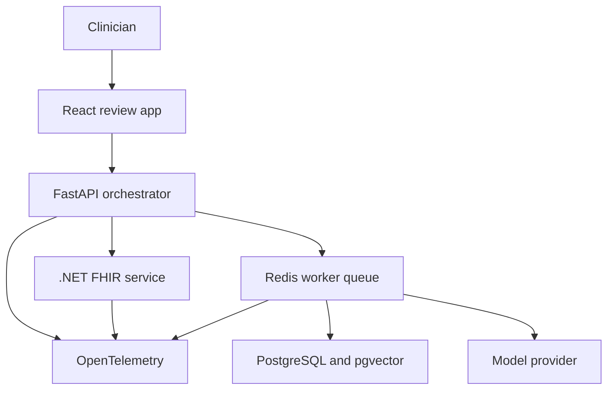
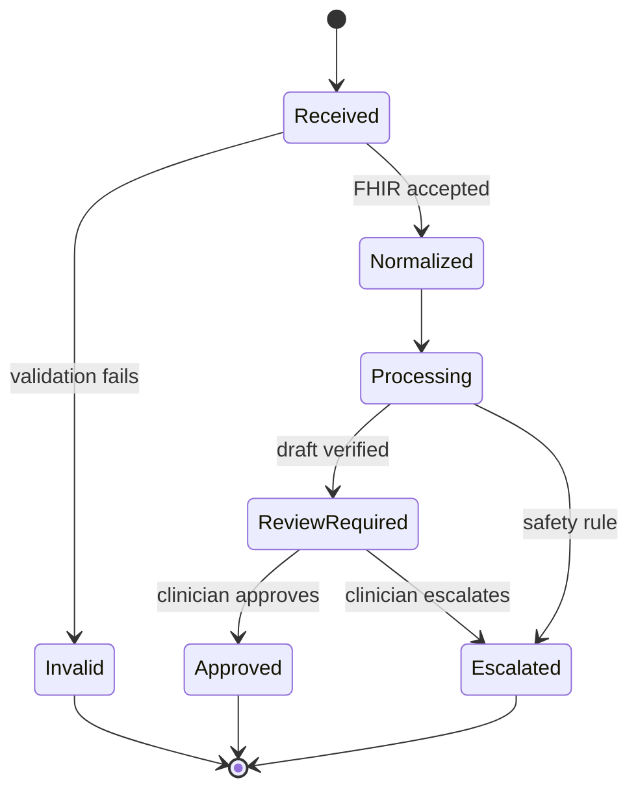

# Architecture

## Design principles

1. **Deterministic workflow before autonomy.** Explicit stages are easier to evaluate, recover, and audit than an unconstrained agent.
2. **FHIR at the boundary.** The .NET service owns validation, reference resolution, terminology normalization, and canonical mapping.
3. **Version every nondeterministic dependency.** Models, prompts, schemas, evidence corpora, and scoring rubrics are recorded for each run.
4. **Human approval is a state transition.** It is enforced server-side, not represented by a cosmetic UI button.
5. **Trace claims to sources.** Material claims carry both patient-record provenance and retrieved-evidence provenance where applicable.
6. **Fail closed.** Unsupported scope, missing critical data, failed citation verification, or security failure leads to escalation—not a confident packet.

## System context

## Service ownership

| Service | Owns | Must not own |
|---|---|---|
| Web | Review experience, corrections, citations, workflow status | Clinical rules, authorization decisions, hidden prompt construction |
| Orchestrator | Workflow state, retrieval, generation, verification, escalation, audit commands | Raw FHIR interpretation |
| FHIR integration | FHIR validation, references, coding normalization, canonical case | Generative clinical prose |
| Worker | Retryable long-running stages and idempotency | User authentication policy |
| PostgreSQL | Durable workflow, audit, corrections, evaluation results | Raw secrets |
| Vector index | Versioned evidence embeddings and metadata | Unversioned web-search results |

## Workflow states

State transitions use optimistic concurrency and an idempotency key. A retry may repeat a completed stage but may not create a second logical workflow or duplicate an audit event.

## Canonical contracts

The schemas in `contracts/` are the integration boundary. Each field may include one or more provenance records pointing to a FHIR resource ID and JSON path. Downstream stages consume the canonical case rather than independently interpreting FHIR.

Contract changes require:

- A new semantic version.
- Migration or explicit incompatibility decision.
- Updated example payloads.
- Updated extraction evaluations.
- Consumer contract tests.

## Evidence retrieval

The corpus is ingested offline. Each chunk records source, publication date, locator, content hash, ingestion timestamp, licensing status, clinical tags, and corpus version. Retrieval combines lexical and vector scores plus metadata filters. Evaluation uses a frozen corpus snapshot and clinician-adjudicated relevant chunk IDs.

## Deployment evolution

- **Local:** Docker Compose with Keycloak, PostgreSQL/pgvector, Redis, services, and OpenTelemetry Collector.
- **Hosted demo:** Azure Container Apps to limit operational overhead.
- **Portability proof:** Terraform modules and basic Kubernetes manifests added after workflow and evaluation quality are established.

## Architecture decisions

Formal decisions live in `docs/adr/` and should be updated when assumptions change.

